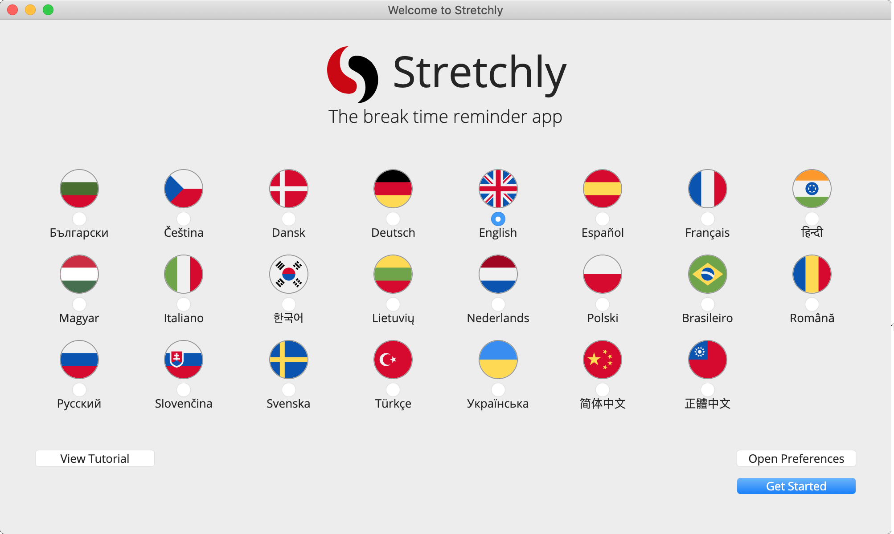
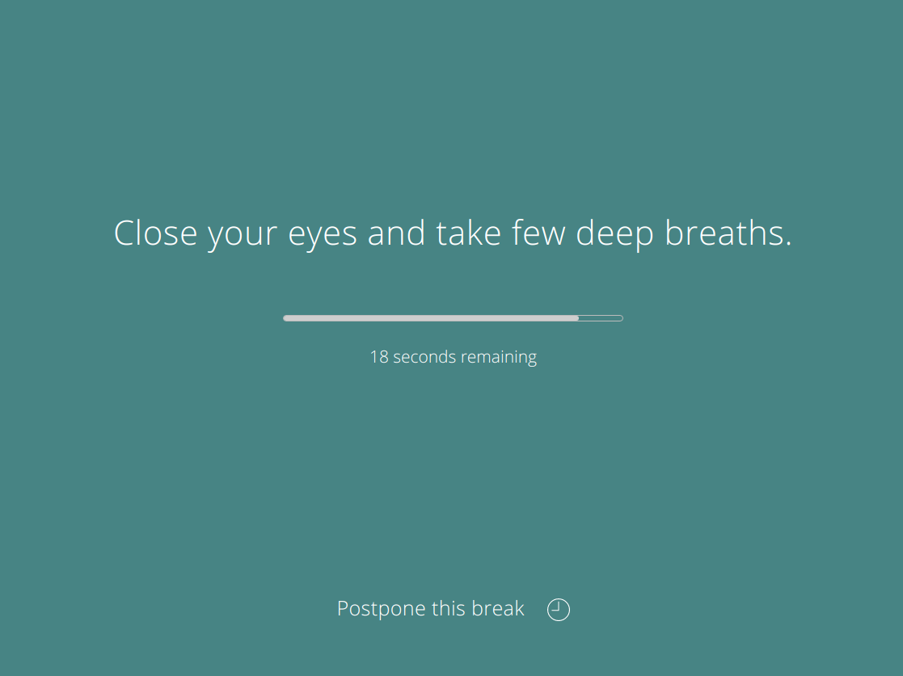
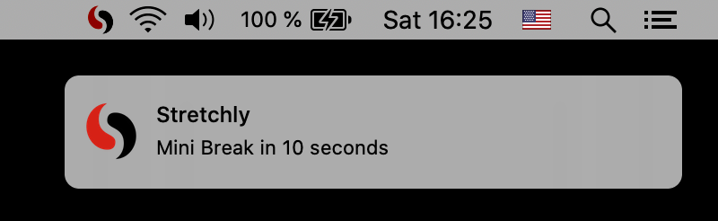
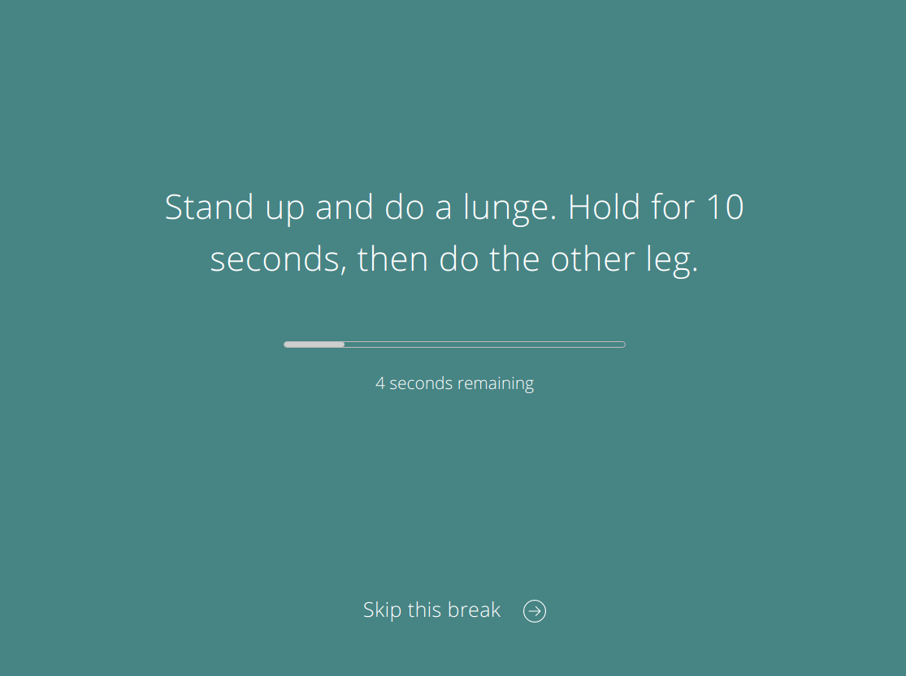
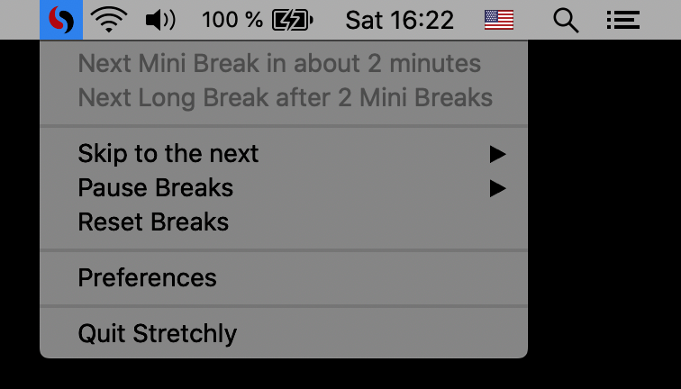
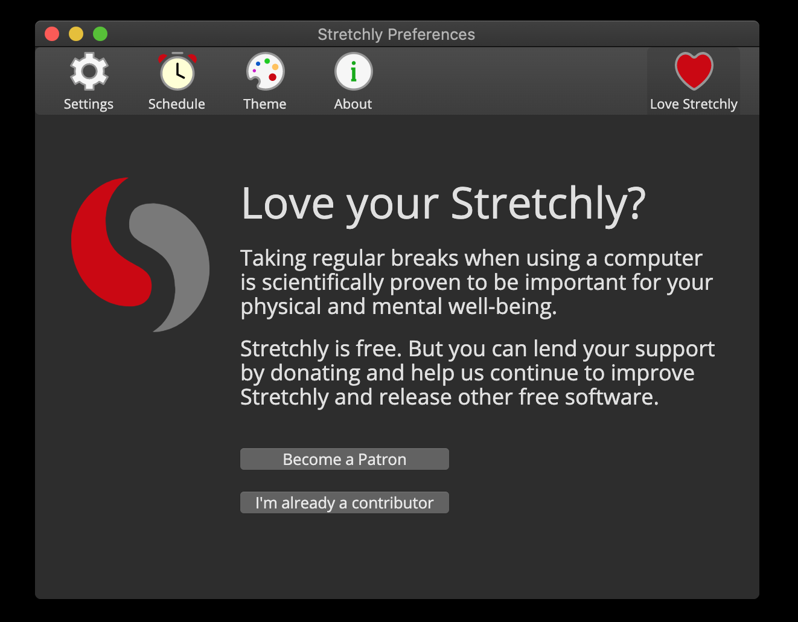
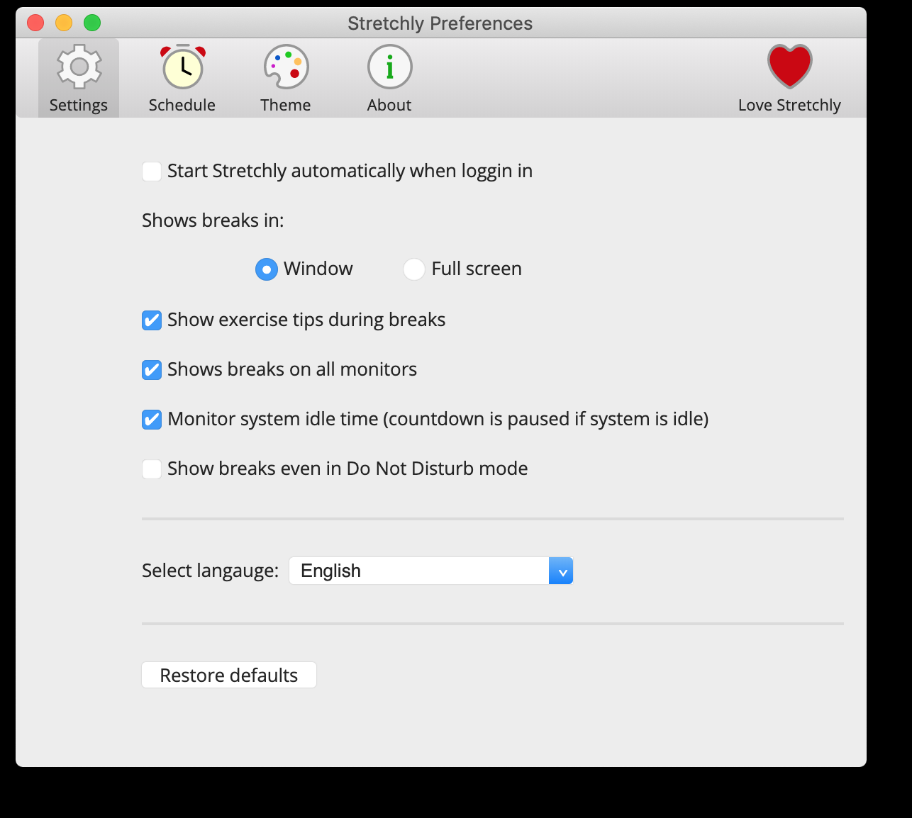
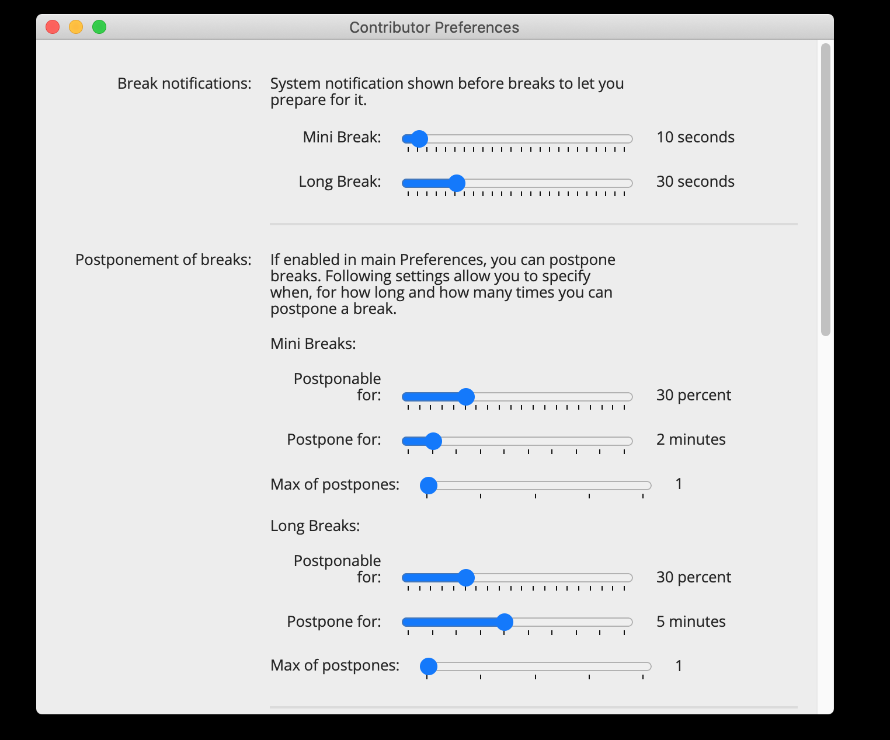

# Stretchly [](https://github.com/humanetech-community/awesome-humane-tech) [](https://travis-ci.org/hovancik/stretchly) [](http://standardjs.com/) [](https://codecov.io/gh/hovancik/stretchly) [](https://gitter.im/stretchly/Lobby?utm_source=badge&utm_medium=badge&utm_campaign=pr-badge&utm_content=badge) [](https://hosted.weblate.org/engage/stretchly/)


> **The break time reminder app**

*Stretchly* is a cross-platform [Electron](https://www.electronjs.org/) app that reminds you to take breaks when working on your computer.

[](https://github.com/sponsors/hovancik) [](https://www.patreon.com/hovancik)

## Table of contents
- [Install](#install--)
- [Default behavior](#default-behavior)
- [Preferences](#preferences)
- [Advanced Preferences](#advanced-preferences)
- [Contributor Preferences](#contributor-preferences)
- [Development](#development)
- [Known issues](#known-issues)
- [Contributors](#contributors)
- [Humans and Tools](#humans-and-tools)
- [License](#license)

## Install [](https://github.com/hovancik/stretchly/releases) [](https://repology.org/project/stretchly/versions)

The latest official **installers** and **portable versions** for macOS, Windows, Linux and FreeBSD can be found at [Github Releases](https://github.com/hovancik/stretchly/releases) page.

### macOS

You can also install *Stretchly* with [Homebrew](https://brew.sh/) by running `brew update && brew install --cask stretchly`. When upgrading, run `brew update && brew upgrade --cask`. Don't forget to Quit Stretchly, first.

If you're using [Alfred](https://www.alfredapp.com) or [Raycast](https://www.raycast.com/) on macOS you can use this [Alfred Workflow](https://github.com/KingOfSpades/stretchFred) or [Raycast Extension](https://www.raycast.com/u-ran/stretchly) to interact with Stretchly.

#### Application Signing

*Stretchly* is not signed (due to its costs) so you will need to use a workaround for the first run. The workaround
depends on if you're running an Intel or Apple Silicon chip.

- **Intel Chips**: [Open a Mac app from an unidentified developer](https://support.apple.com/guide/mac-help/open-a-mac-app-from-an-unidentified-developer-mh40616/mac).
- **Apple Chips**: Open a terminal and run this command:

```bash
    sudo xattr -r -d com.apple.quarantine /Applications/Stretchly.app
```

If you install via [Homebrew](https://brew.sh), you can use the `--no-quarantine` flag to automatically apply the correct
workaround.

```bash
brew install --cask --no-quarantine stretchly
```

Not sure which chip your computer has? [Here's how to tell](https://support.apple.com/en-us/HT211814).

### Windows

You can also install *Stretchly* with [Chocolatey](https://chocolatey.org) by running the following command from the command line or from PowerShell: `choco install stretchly`. Upgrade with `choco upgrade stretchly`.

Stretchly is also available in Microsoft's [winget](https://docs.microsoft.com/en-us/windows/package-manager/winget/).

You can install *Stretchly* for all users silently by running this as administrator: `installer.exe /S /allusers`.

### Linux / Portable

For portable versions and for Linux installers, head to [Github Releases page](https://github.com/hovancik/stretchly/releases). The most widely used distributions should be covered. 

Stretchly is also available in some of the Linux stores: 
- [Flathub](https://flathub.org/apps/details/net.hovancik.Stretchly)
- [Snap Store](https://snapcraft.io/stretchly)

For Debian/Ubuntu and derivates you could also try this `apt` repositury: `deb [trusted=yes] https://apt.fury.io/hovancik/ /`.

#### Linux note

Please see [http://electron.atom.io/docs/api/tray/](http://electron.atom.io/docs/api/tray/) for Electron's Tray Linux specifics.

For Natural breaks, you might need some packages too (`libxss-dev`).

If *Stretchly* is not starting, you might need to run `sudo sysctl kernel.unprivileged_userns_clone=1`. Read more [here](https://github.com/electron/electron/issues/17972). Depending on your distro, you probably want to do something similar to this, so the preferences are kept after reboot: Add `kernel.unprivileged_userns_clone=1` to `/etc/sysctl.d/00-local-userns.conf` and reboot.

### Running from source

To run *Stretchly* from source you will need [Node.js](https://nodejs.org/), ideally the one specified in `package.json`. Clone the repo, run `npm install` and then simply run `npm start` to start *Stretchly*.

### Custom installer

You can create a custom installer by running `npm run pack` or `npm run dist` after `npm install --no-save`.

## Default behavior

When you run *Stretchly* for the first time, you are presented with a Welcome window that allows you to change the language, review the preferences, view the online tutorial or simply continue with the default preferences.



*Stretchly* itself lives in your tray, only displaying a reminder window from time to time, which contains an idea for a break.



By default, there is a 20 second Mini Break every 10 minutes and a 5 minute Long Break every 30 minutes (after 2 Mini Breaks).


You'll be notified 10 seconds before a Mini Break (and 30 seconds before a Long Break) so that you can prepare to pause your work.



When a break starts, you can postpone it once for 2 minutes (Mini Breaks) or 5 minutes (Long Breaks). Then, after a specific time interval passes, you can skip the break. Both actions are available by clicking on the link at the bottom of window or by using the `Ctrl/Cmd + X` keyboard shortcut.



Clicking the *Stretchly* icon in your tray area will display the current status of breaks, provide menu items with extra functionality, and link to the Preferences.



*Stretchly* is monitoring your idle time, so when you are idle for 5 minutes, breaks will be paused until you return.

*Stretchly* is also monitoring Do Not Disturb mode, so breaks are paused when DnD mode is On.

*Stretchly* follows the theme of your system and is also available in dark mode.



### Interact with stretchly from command line

When a Stretchly instance is running, the `stretchly` command can be use to interact with it from the command line.

Type `stretchly help` to get a list of all commands and options available as well as some examples.

## Preferences

Most of the preferences can be customized by clicking on the "Preferences" item in the tray menu.



Preferences are divided into multiple categories and you are encouraged to take some time to make *Stretchly* your own by customizing them.

You can also Restore the defaults to return to the default preferences state.

## Advanced Preferences

While the most of the preferences can be edited via the app, some options and values are not available to make the app easy to understand and setup.

All preferences are saved in a JSON file, so you can set Stretchly in the way you need. Use the `Ctrl/Cmd + D` shortcut while viewing the About section of Preferences, to show debug info and display a clickable link to the preferences file.

It's recommended to Quit *Stretchly* before editing the preferences file.

To make sure that all works as expected, it's always good idea to check that format of the preferences file is correct, ie. by using [jsonformatter](https://jsonformatter.curiousconcept.com/).

After you make changes to preferences files, some of the values being shown in Preferences or elsewhere might show incorrect value, as the UI is expecting specific values and is not handling cases where user makes manual changes to preferences file.

Some of the extra preferences are available in Contributor Preferences for [Contributors](#contributor-preferences). Those are marked by [](#contributor-preferences) badge.

Preferences marked with  might not work correctly and might break *Stretchly*. Use at own risk.

**Note:** Before 1.0, Mini Breaks and Long Breaks were called Microbreaks and Breaks, respectively. To keep the upgrade smooth they still use that name in preferences file and in code.

#### Preferences editable in the app

Here are the preferences editable via the app. If values in the app does not suite your style, you could edit them maually: 

- `microbreakDuration` - duration of Mini Break (ms)
- `microbreakInterval` - interval of Mini Break (ms)
- `breakDuration` - duration of Long Break (ms)
- `breakInterval` - interval of Long Break (Mini Breaks)
- `breakNotification` - show notification before Mini Break
- `microbreakNotification` - show notification before Long Break
- `microbreak` - enable Mini Breaks
- `break` - enable Long Breaks
- `microbreakStrictMode` - enable strict mode for Mini Breaks
- `breakStrictMode` - enable strict mode for Long Breaks
- `mainColor` - theme color code (for Long Breaks),
- `miniBreakColor` - theme color code (for Mini Breaks),
- `transparentMode` - show break windows as transparent
- `audio` - sound theme name (for Long Breaks)
- `miniBreakAudio` - sound theme name (for Mini Breaks)
- `fullscreen` - show breaks in fullscreen mode
- `ideas` - show break ideas
- `naturalBreaks` - monitor idle time
- `allScreens` - show breaks on all screens
- `language` - language
- `useMonochromeTrayIcon` - use monochrome icon
- `useMonochromeInvertedTrayIcon` - use inverted monochrome icon
- `silentNotifications` - enable sounds
- `monitorDnd` - monitor DND mode
- `checkNewVersion` - check for new versions

#### Editing Break ideas
In the preferences file, change `useIdeasFromSettings: false,` to `useIdeasFromSettings: true,` and edit `breakIdeas` and `microbreakIdeas`.

Note that when a new *Stretchly* version with new break ideas is out, your custom ideas will not be overwritten. You can reset break ideas to the latest defaults when you "Restore defaults" from Preferences window.

#### Editing Break notification interval [](#contributor-preferences)

In the preferences file, change `breakNotificationInterval: 30000,` to whatever value you want. 30000 is 30 seconds. Same goes for Mini Breaks.

#### Editing sunrise time to pause breaks until morning
In the preferences file you can set the `morningHour` setting to pause until that hour today or the next day
Otherwise, you can set `morningHour: "sunrise"` and set `posLatitude`, `posLongitude` in
preferences to pause until the actual sunrise in your area.
E.g. if you live in Boston you would set:
`morningHour: "sunrise",`
`posLatitude: 42.3,`
`posLongitude: 71`

#### Editing postpone functionality [](#contributor-preferences)
In the preferences file, you can edit `microbreakPostpone` and `breakPostpone` to enable or disable the ability to postpone breaks, `microbreakPostponeTime` and `breakPostponeTime` to change the postpone time in milliseconds, `microbreakPostponesLimit` and `breakPostponesLimit` to change the number of allowed postpones per break, and finally, `microbreakPostponableDurationPercent` and `breakPostponableDurationPercent` to change the percentage of the break during which the user can postpone it.

#### New version notification [](#contributor-preferences)
In the preferences file, set `notifyNewVersion: false,` to disable new version notification.

#### Play sound at the start of the Break [](#contributor-preferences)
In the preferences file, set `microbreakStartSoundPlaying: true,` to start a Mini Break with a sound (The same sound will be played as at the end of the break). Same for `breakStartSoundPlaying`.

#### Different sound for Mini and Long breaks
To play different sound for Mini Breaks, set `miniBreakAudio` to desired value (`crystal-glass`, `silence`, `tic-toc`, `wind-chime`). 

#### Different color theme for Mini and Long breaks
To have different theme for Mini Breaks, set `miniBreakColor` to desired value, ie `#123456`.

#### Natural breaks inactivity time [](#contributor-preferences)
In the preferences file, set `naturalBreaksInactivityResetTime` to your preferred value (in milliseconds greater than than 20000ms). This is an idle time length, after which *Stretchly* breaks will be paused until the user resumes activity.

#### Volume for break sounds [](#contributor-preferences)
In the preferences file, set `volume` to your preferred value. Default value is `1`, which is 100% volume. Set it, for example, to `0.61` for 61% volume.

#### Postpone/Finish Break Shortcut
In the preferences file, set `endBreakShortcut` to your preferred value. We do not validate this input, so please check [Electron's documentation](https://www.electronjs.org/docs/api/accelerator) for available values for key and modifier. When a given accelerator is already taken by other applications, this call will silently fail. This behavior is intended by operating systems, since they don't want applications to fight for global shortcuts.

If you'd like to disable the shortcut, set value to empty string `""`.

Default value is `CmdOrCtrl+X`.

#### Toggle Breaks Shortcut

Toggling between Pause Breaks and running breaks.

In the preferences file, set `pauseBreaksToggleShortcut` to your preferred value. We do not validate this input, so please check [Electron's documentation](https://www.electronjs.org/docs/api/accelerator) for available values for key and modifier. When a given accelerator is already taken by other applications, this call will silently fail. This behavior is intended by operating systems, since they don't want applications to fight for global shortcuts.

If you'd like to disable the shortcut, set value to empty string `""`. That's the default value as well.

#### Appearance [](#contributor-preferences)
In the preferences file, change `themeSource: 'system'` to either `'light'` or `'dark'` to always use the specified theme.

#### Break window color
In the preferences file, change `mainColor` to whatever color you like.

#### Welcome window [](#contributor-preferences)
To show the Welcome window again on the next start, change `"isFirstRun"` to `true`.

#### Theme transparency [](#contributor-preferences)
To specify how solid the break window should be when Theme transparency is enabled, set the value of `opacity` from `0` to `1` (which is in turn 0 to 100%).

#### Break window size [](#contributor-preferences)
To specify the size of the break window, set the value of `breakWindowHeight` and `breakWindowWidth` from `0` to `0.99` (which is in turn 0 to 99% of the size of the screen). Don't set 100% as that's fullscreen.

#### Make Stretchly show breaks as regular windows [](#contributor-preferences) 

If you want Stretchly breaks to act as regular windows (have a titlebar, turn off always on top, be minimizable and focusable) set `showBreaksAsRegularWindows` to `true`.

#### Pause/resume breaks only when specific command is running

By editing `appExclusions` in preferences file, you can automatically control when Stretchly breaks are paused.

If you want Stretchly to be paused when specific apps are running, you could have this value (breaks are paused when Skype or Atom are running):

```
"appExclusions": [
    {
        "rule": "pause",
        "active": true,
        "commands": [
            "/usr/share/skypeforlinux/skypeforlinux",
            "atom"
        ]
    }
]
```

If you want Stretchly to be running when specific apps are as well, you could have this value (breaks are paused when Skype or Atom are not running):

```
"appExclusions": [
    {
        "rule": "resume",
        "active": true,
        "commands": [
            "/usr/share/skypeforlinux/skypeforlinux",
            "atom"
        ]
    }
]
```

You can specify multiple values, (as `appExclusions` is array) and Stretchly will take the first one that is marked as `"active": true`. Multiple `commands` can be specified as well. Commands should be case sensitive, but seems like this is not consistent across platforms. Therefore, sometimes, going all lowercase might be needed (this was noticed on Windows). 

You can also specify `appExclusionsCheckInterval` in milliseconds: lower number means more often checks, but also higher CPU usage. Default value is `1000` which is 1 second.

#### Pause breaks on Suspend/Lock 
If you don't want to reset breaks once system is back from Suspend/Lock, set `pauseForSuspendOrLock` to `false`.

#### Monitor to show breaks on 
In case you have disabled showing of breaks on all monitors, you can specify which one should contain the break window. Set `screen` value to one of the following:
- `"primary"` - primary monitor as given by OS
- `"cursor"` - monitor where there is cursor
- `"0"` (or `0`), `"1"`, `"2"` etc, where `"0"` is the first monitor returned by OS and so forth

#### Show time to the next break in menubar icon [](#contributor-preferences) 

If you want Stretchly to show time to the next break in menubar icon set `timeToBreakInTray` to `true`.

#### Show current time in breaks [](#contributor-preferences)
To show current time in breaks, set the value of `currentTimeInBreaks` from `false` to `true`.

## Contributor Preferences

*Stretchly* is free but you can support it by contributing code, translations or money. You will be rewarded by getting access to **Contributor Preferences**, ability to **Sync Preferences**, chat on **Discord** and more!

You can access contributor features after authenticating with  Github or Patreon in the "Love Stretchly" section of Preferences.



### [Sponsoring on Github](https://github.com/sponsors/hovancik) [](https://github.com/sponsors/hovancik)

GitHub Sponsors **does not charge any fees** for sponsorships from user accounts, so 100% of these sponsorships go to the sponsored developer or organization. [Github Sponsors Matching Fund](https://docs.github.com/en/free-pro-team@latest/github/supporting-the-open-source-community-with-github-sponsors/about-github-sponsors#about-the-github-sponsors-matching-fund) will also **match every donation**.

*You will be able to access Contributor Preferences, Sync Preferences.
You won't be able to chat on Discord.*

### [Sponsoring on Patreon](https://www.patreon.com/hovancik) [](https://www.patreon.com/hovancik)

Patreon [has fees](https://support.patreon.com/hc/en-us/articles/360027674431-Creator-fees-breakdown) plus it uses PayPal, which has its fees as well.

*You will be able to access Contributor Preferences, Sync Preferences and Discord chat.*

### Donating with Crypto currencies

#### Bitcoin
 `3EyJNtJPuQjfqP5czN88kPySwxVjv7h42y`

#### Ethereum

 `0x377f05E76e96EC4C19fF225e767FeD77b1750294`

#### Zcash

 `t1XyjwJtViEqATUnPKG6mdUwN4TkoCfxzcM`

Let me know if you would like to use some other currency.

*Currently, there are no rewards for donating with Crypto currencies, as we can't programmatically match them.*


### [Donating with PayPal](https://paypal.me/JanHovancik) [](https://paypal.me/JanHovancik)
PayPal has fees.

*Currently, there are no rewards for donating via PayPal, as we can't programmatically match them.*

### [Contributing code](#development)

*By contributing code (or translations), you will be able to access Contributor Preferences, Sync Preferences.
You won't be able to chat on Discord.*

## Development
Feel free to join in the [development](https://github.com/hovancik/stretchly/blob/master/CONTRIBUTING.md) of this app via Issues and Pull Requests.

**Before implementing a feature, please open an Issue first, so we can be sure that no one else is working on it and that the changes will be accepted. It is important do discuss changes before implementing them (Why should we add it? How should it work? How should it look? Where will it be? ...).**

### Pre-requisites
- [Node.js](https://nodejs.org/) (please use version specified in `package.json`)
  - Linux/MacOS - you might want to use [Node Version Manager](https://github.com/nvm-sh/nvm) to install specific version
  - Windows - download [installer](https://nodejs.org/en/download/) for specific version; during installation *check* “Install Additional Tools for Node.js”
- [git](https://git-scm.com/)
- [Github account](https://github.com/), if you'd like to upstream your changes

Now you can clone the repo with `git clone https://github.com/hovancik/stretchly.git`. Change to the new created directory and run `npm i` to install node packages needed.

Read on.

### Debugging

You can use Stretchly's built-in debug shortcut by pressing `Ctrl/Cmd + D` in the About section to show information such as:
  - Location of the Preferences and Log file (Clicking on file location will open it),
  - Debug information for break planner

You can copy debug information to the clipboard.

If you start *Stretchly* in development mode with the `npm run dev` command, it makes it possible to debug the application in your browser on `http://localhost:9222`.

### Logging

*Stretchly* uses `[log](https://github.com/megahertz/electron-log)` package for some extra logging.
Format as following:
- `System: my message` for messages regarding Operating System, ie: `System: resume or unlock`
- `Stretchly: my message` for messages regarding *Stretchly*

### Translations

You can help to translate Stretchly on [Weblate](https://hosted.weblate.org/engage/stretchly). Consider joining with your Github account to be correctly credited.
[](https://hosted.weblate.org/engage/stretchly/)


## Known issues
- power monitoring not working properly ([electron/electron#8560](https://github.com/electron/electron/issues/8560))

### MacOS
- users experiencing their Dock hiding after a break, requiring command + tab or a mouse click to get focus back, check System Preferences > Users & Groups > {User} > Login Items. If Hide is checked for Stretchly, uncheck it, it should solve the issue.

### Windows
- users who upgraded to Windows 10 from previous Windows versions might be in "Do Not Disturb mode" all the time so they need to check "Show breaks even in Do Not Disturb mode"
- users with Chromium-based browser (Chrome, Edge, etc...) [might need to set some flags](https://github.com/hovancik/stretchly/issues/783#issuecomment-762819646) when browser is non-responsive after break

## Contributors

- Jan Hovancik, @hovancik, [hovancik.net](https://hovancik.net)
- Martina Mocinecova, (pre-1.0 *Stretchly* logo), color schemes
- Jason Barry, @JCBarry, [jcbarry.com](http://jcbarry.com)
- Alex Alekseyenko, @alexalekseyenko
- Sean Manton, @sxmanton
- Yuriy Gromchenko, @gromchen
- Mael, @laem
- Marian Dolinský, @bramborman
- midpoint, @midpoint
- stothew, @stothew
- Zhivko Kabaivanov, @unholyHub
- sergiopjf, @sergiopjf
- William Chang, @wilicw
- Purva, @purva98
- Riddhi, @riddhi99
- Fahim Dalvi, @fdalvi, [fdalvi.github.io](https://fdalvi.github.io)
- Nic Desjardins, @nicdesjardins
- Vladislav Kuznecov, @fizvlad
- Oleg V., @neooleg
- Manuel Jesús Aguilera Castro, @manueljaguilera
- Ciprian Rusen, [www.digitalcitizen.life](https://www.digitalcitizen.life)
- Carlo Gandolfi, @cgand
- Kavya Jain, @kavya-jain
- Denys Otrishko, @lundibundi
- p-bo, @p-bo
- Alina Leuca, @alinaleuca
- Sabine van der Eijk, @Sabin_E
- JavaScript Joe, [@jsjoeio](https://github.com/jsjoeio)
- Ismail Demirbilek, [@dbtek](https://github.com/dbtek)
- Giacomo Rossetto, [@jackymancs4](https://github.com/jackymancs4)
- Hum4n01d, [@hum4n01d](https://github.com/hum4n01d)
- Ary Borenszweig, [@asterite](https://github.com/asterite)
- Jonatan Nyberg, @jony0008
- Gowee [@Gowee](https://github.com/Gowee)
- William Lin, [@FanciestW](https://github.com/FanciestW)
- Hisman Yosika, [@dnjstlr555](https://github.com/dnjstlr555)
- Mehmet Fatih Yıldız, [@mfyz](https://github.com/mfyz)
- Sunny Dhoke, [@sunn-e](https://github.com/sunn-e)
- Przemysław Rząd, [@rzadp](https://github.com/rzadp)
- Artūras Stifanovičius, [@troyanas](https://github.com/troyanas)
- pan93412, [@pan93412](https://github.com/pan93412)
- robot-5, [robot-5](https://github.com/robot-5)
- mfyz, [mfyz](https://github.com/mfyz)
- ValarMarkhulis [ValarMarkhulis](https://github.com/ValarMarkhulis)
- Lucas Costi, [@lucascosti](https://github.com/lucascosti)
- Luke Arms, [lkrms](https://github.com/lkrms)
- Chris Heyer, [@cheyer](https://github.com/cheyer)
- Sheri Richardson, [@sheriallis](https://github.com/sheriallis/)
- Florine W. Dekker, [@FWDekker](https://github.com/FWDekker)
- Balazs Nasz, [@balazsnasz](https://github.com/balazsnasz)
- Daniel Bankmann, [@dbankmann](https://github.com/dbankmann)
- Aziks, [@Aziks0](https://github.com/Aziks0)
- mwoz123, [@mwoz123](https://github.com/mwoz123)
- pramit-marattha, [@pramit-marattha](https://github.com/pramit-marattha)
- Benedikt Allendorf, [@BenediktAllendorf](https://github.com/BenediktAllendorf)
- Haechan Song, [@hcsong213](https://github.com/hcsong213)
- Will, [@qubist](https://github.com/qubist)
- Abhilash Mandaliya, [@abhilashmandaliya](https://github.com/abhilashmandaliya)
- Masi, [@The-Coding-Classroom](https://github.com/The-Coding-Classroom)
- Saksham Sharma, [@ssaksham](https://github.com/ssaksham)
- Jared Wood, [@jwood13](https://github.com/jwood13)
- Febin Jose, [@JoeNibe](https://github.com/JoeNibe)
- João Barreiros, [@unstablectrl](https://github.com/unstablectrl)
- Vova Babii, [@JARVIS-VOVA](https://github.com/JARVIS-VOVA)
- Ben Hammond, [@benhamondmusic](https://github.com/benhammondmusic)
- Jordan Williams, [@jwillikers](https://github.com/jwillikers)
- Nai You-Ran, [@skyran1278](https://github.com/skyran1278)
- Lorenzo García Rivera, @lorenzogrv, [lorenzogrv.tech](https://lorenzogrv.tech)

Also see Github's list of [contributors](https://github.com/hovancik/stretchly/graphs/contributors).

1.0 Icon and UI design by Colin Shanley ([www.colinshanley.com](http://www.colinshanley.com/)).

## Humans and Tools
 - https://github.com/HatScripts/circle-flags
 - https://www.icoconverter.com/ to generate .ico
 - http://www.img2icnsapp.com/ to create .icns
 - https://developer.microsoft.com/en-us/microsoft-edge/tools/vms/
 - http://web.stanford.edu/dept/EHS/prod/general/ergo/microbreaks.html
 - https://www.spineuniverse.com/wellness/ergonomics/workstation-ergonomics-take-break
 - http://www.lifehack.org/articles/productivity/21-counter-intuitive-break-ideas-to-boost-your-productivity-at-work.html
 - http://www.latofonts.com/lato-free-fonts/
 - http://www.huffingtonpost.com/2012/07/24/sitting-at-work-why-its-dangerous-alternatives_n_1695618.html
 - http://www.unm.edu/~lkravitz/Article%20folder/sittingUNM.html
 - https://www.ninds.nih.gov/News-Events/News-and-Press-Releases/Press-Releases/Want-learn-new-skill-Take-some-short-breaks
 - https://www.painscience.com/articles/chair-trouble.php
 - https://www.painscience.com/articles/microbreaking.php
 - https://github.com/CognirelTech/Quillpad-Server
 - https://www.webmd.com/fitness-exercise/a-z/seven-minute-workout
 - https://www.poetryfoundation.org/poems/57243/how-to-be-perfect
 - https://justworks.com/blog/improve-mental-health-work-midday-break-ideas
 - https://www.nutritiousmovement.com/dynamic-at-home-work-and-school-spaces/
 - https://www.onhealth.com/content/1/eye_exercises_and_stretches
 - https://www.webmd.com/pain-management/exercises-carpal-tunnel-syndrome

#### Sounds credits
Sounds used in this application are listed [here](http://freesound.org/people/hovancik/bookmarks/category/58865/).
- `crystal glass` by [mlteenie](http://freesound.org/people/mlteenie/), available under the [Attribution License](http://creativecommons.org/licenses/by/3.0/).
- `wind chime` by [GnoteSoundz](http://freesound.org/people/GnoteSoundz/), available under the [Creative Commons 0 License](http://creativecommons.org/publicdomain/zero/1.0/).
- `tic toc` by [magundah14](http://freesound.org/people/magundah14/), available under the [Creative Commons 0 License](http://creativecommons.org/publicdomain/zero/1.0/).
- `silence` by [parcodeisuoni](http://freesound.org/people/parcodeisuoni/), available under the [Attribution License](http://creativecommons.org/licenses/by/3.0/).

#### Fonts credits
This app uses [Noto Sans](https://fonts.google.com/specimen/Noto+Sans) fonts licensed under the [Apache License, Version 2.0](http://www.apache.org/licenses/LICENSE-2.0).

## License
See [LICENSE](https://github.com/hovancik/stretchly/blob/master/LICENSE) file.
